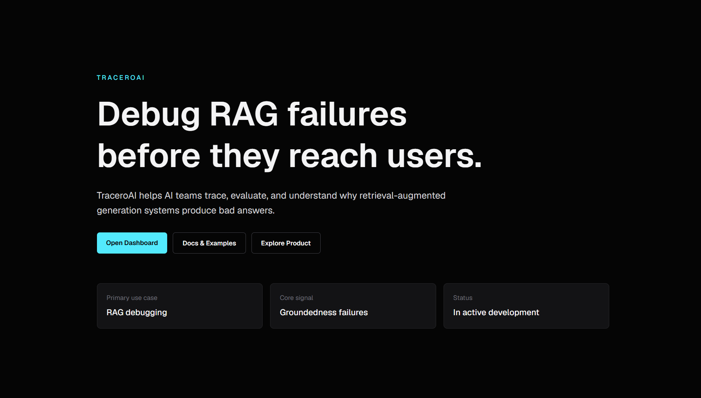
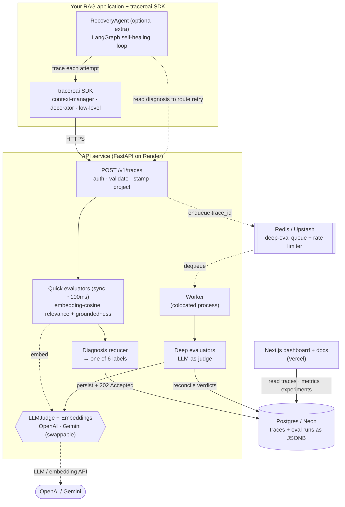
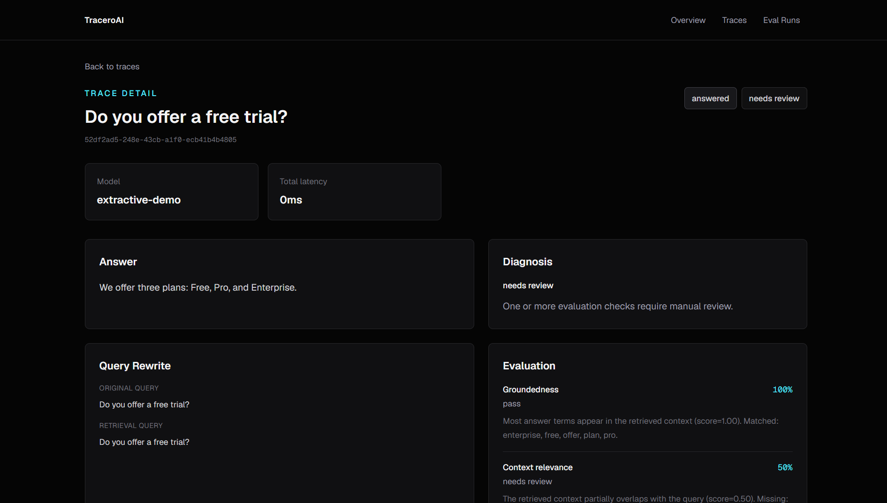
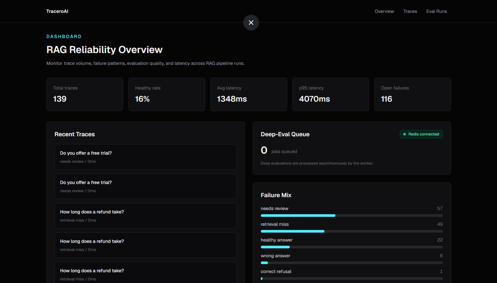

<div align="center">

# TraceroAI

**RAG observability, evaluation, and debugging — built like production infrastructure.**

When a RAG answer is wrong, TraceroAI shows *why*: whether the failure came from
retrieval, the context, grounding, or the generated answer.

[](https://pypi.org/project/traceroai/)
[](https://www.python.org/)
[](./LICENSE)

**[Live demo →](https://www.traceroai.tech)** &nbsp;·&nbsp;
**[Interactive docs →](https://www.traceroai.tech/docs)** &nbsp;·&nbsp;
**[PyPI →](https://pypi.org/project/traceroai/)**

</div>



---

## The problem

A bad RAG answer is only a *symptom*. The real cause could be anywhere in the pipeline:

```
user query → retrieval → context selection → prompt → generation → answer
```

Teams ship RAG systems with almost no visibility into *which stage* failed. Was the
right document never retrieved? Was it retrieved but ignored? Did the model
hallucinate beyond its context? "The answer is wrong" doesn't tell you where to look.

**TraceroAI traces every RAG answer and diagnoses the failure stage**, so debugging
becomes a lookup instead of a guess.

## What it does

- **Trace every answer** — capture the query, retrieved chunks, prompt, generated
  answer, and latency as one timeline.
- **Two-tier evaluation** — fast **embedding-based** semantic checks on every trace
  (context/answer relevance via cosine similarity), plus an optional **LLM-as-judge**
  for claim-level groundedness the cheap checks can't reason about.
- **Automatic diagnosis** — each trace is labeled with one of six outcomes:

  | Diagnosis | Meaning |
  |---|---|
  | `healthy_answer` | retrieval, grounding, and relevance all pass |
  | `correct_refusal` | model correctly declined when context didn't support an answer |
  | `retrieval_miss` | retrieved context doesn't match the query |
  | `unsupported_claim` | answer asserts things the context doesn't support |
  | `wrong_answer` | answer doesn't address the query |
  | `needs_review` | mixed signals — flagged for a human |

- **Drop-in SDK** — `pip install traceroai`; instrument any RAG pipeline in a few lines.
- **Self-healing recovery** (`pip install traceroai[recovery]`) — a LangGraph agent that
  retries the stage TraceroAI diagnoses as broken: a retrieval miss re-retrieves with
  more context, an unsupported claim re-generates with a stricter prompt, and it escalates
  to human review after a bounded number of attempts. Every attempt is traced.
- **Experiment evaluation** (`traceroai.eval`) — A/B-test pipeline configs against a
  labeled dataset; each answer is graded by the server-side judge, the best variant is
  recommended, and the run lands on your dashboard. Bring your own retrieve/generate.
- **Cost & token tracking** — per-trace prompt/completion tokens and computed cost.
- **Multi-tenant ingest** — project API keys attribute traces to a project; reads stay
  open so a recruiter can explore the demo without a key.

See **[USAGE.md](USAGE.md)** for a complete guide to every SDK feature.

## Architecture

TraceroAI separates the **write path** (fast, synchronous, must never block the caller)
from the **evaluation path** (slow, costly, rate-limited). Ingest returns in
milliseconds; expensive LLM judgement happens asynchronously and is reconciled back
onto the trace.



> Solid arrows are the synchronous request path; dotted arrows are the asynchronous
> evaluation path. The **RecoveryAgent** runs client-side: it traces each attempt and
> reads back the diagnosis to decide whether (and how) to retry.

### Request lifecycle

1. The SDK sends a trace (query, retrieved chunks, prompt, answer) to `POST /v1/traces`.
2. The API authenticates the project key, runs the **quick evaluators** (embedding-cosine
   relevance + groundedness), computes a **diagnosis**, persists the trace, and returns
   **`202 Accepted`** — the caller is never blocked on evaluation.
3. The trace id is pushed onto a **Redis queue**.
4. A **worker** dequeues it and runs the **LLM-as-judge** deep evaluators, then
   reconciles the richer verdicts back onto the stored trace.
5. The **dashboard** reads traces, aggregate metrics, and experiment results.

Beyond this core flow, two SDK features build on it: the **experiment harness**
(`traceroai.eval.run_experiment`) replays a labeled dataset across pipeline configs,
grades via the server-side judge (`POST /v1/eval/grade`), and recommends a winner; and
the **RecoveryAgent** uses the per-attempt diagnosis to drive a self-healing retry loop.
Both inject your own retrieve/generate — the platform owns evaluation + storage, not the
pipeline.

### Design decisions & trade-offs

| Decision | Why | Trade-off accepted |
|---|---|---|
| **Two-tier evaluation** (embedding similarity → LLM judge) | Fast embedding-cosine relevance catches most cases semantically in ~100ms; the LLM judge does the claim-level reasoning the cheap layer can't | The quick label can be briefly "stale" until the judge reconciles |
| **Hosted embeddings, not local** | Embedding relevance runs via a hosted API (reusing the judge config), so the lean API process never has to load PyTorch / a model into memory | A network call + tiny per-trace cost vs. a local model |
| **Async deep eval via Redis queue** | LLM calls are slow and rate-limited; keeping them off the ingest path keeps `POST /v1/traces` fast and resilient | Eventual consistency — a trace is diagnosed twice (quick, then deep) |
| **`LLMJudge` / embeddings behind config** | Provider is a one-line swap (OpenAI ↔ Gemini's OpenAI-compatible endpoint); makes eval unit-testable with stubs | A thin abstraction layer over the provider SDK |
| **Self-healing recovery as an opt-in extra** (`traceroai[recovery]`) | A LangGraph loop turns the eval pipeline into a feedback signal that *fixes* answers, not just observes them; shipped as an extra so the base SDK stays lean | Pulls langgraph only for users who want it; bounded by max-attempts to prevent infinite loops |
| **Eval-runs harness grades correctness with an LLM** | A/B-comparing pipeline configs needs a correctness signal; grading failures are tracked as *ungradeable*, not silently counted as wrong | Cost of one LLM call per case; mitigated by small datasets |
| **Cost priced from a live source** | The SDK sends token counts; the server prices them from the community-maintained LiteLLM map (~thousands of models, cached) with a small built-in table as fallback — so prices stay current without hand-maintenance | One cached fetch on startup; unknown models return no cost (never guessed) |
| **Traces stored as JSONB** | The trace schema evolves fast; JSONB avoids migrations per field while still being queryable | Less rigid than fully normalized columns |
| **Fail-open everywhere** | No key, a 429 from the provider, or an unreachable Redis must never break ingest or the public demo | A degraded path silently falls back to the cheaper result |
| **Per-IP rate limit on the public demo** | The `/playground` endpoint is unauthenticated and burns shared LLM quota; a fixed-window Redis counter caps abuse | Fixed-window is coarser than a sliding window (acceptable for a demo) |

See [`docs/traceroai-system-plan.md`](docs/traceroai-system-plan.md) for the full design.

## Screenshots

| Trace detail — *the diagnosis* | Reliability dashboard |
|---|---|
| [](docs/media/trace-detail.png) | [](docs/media/dashboard.png) |
| A wrong answer is a *symptom* — the trace shows the per-stage evaluation that explains the cause. | Trace volume, healthy rate, p95 latency, failure mix, and live deep-eval queue depth. |

## Quickstart

Install the SDK:

```bash
pip install traceroai
```

Instrument your RAG pipeline (context-manager style — auto-times the block and sends
the trace on exit):

```python
from traceroai import TraceroClient

client = TraceroClient(
    base_url="https://traceroai.onrender.com",
    api_key="your_project_key",
)

with client.trace("How long does a refund take?") as t:
    chunks = retrieve(query)              # your retriever
    t.log_retrieval(chunks, strategy="hybrid")
    answer = generate(prompt, chunks)     # your LLM
    t.log_generation(answer, model="gpt-4o-mini")
```

Then open the [dashboard](https://www.traceroai.tech) to inspect the trace — or
[try the live playground](https://www.traceroai.tech/docs) with no signup.

A complete, runnable example is in [`examples/recovery-agent/`](examples/recovery-agent/) —
it showcases tracing, self-healing recovery, and an eval run (`python app.py --eval`).

## Tech stack

| Layer | Stack |
|---|---|
| **API** | FastAPI · Pydantic · SQLAlchemy |
| **Storage** | Postgres (JSONB) · Redis (async deep-eval queue + rate limiter) |
| **Evaluation** | Embedding-cosine relevance · LLM-as-judge (OpenAI / Gemini, swappable) · experiment harness |
| **SDK** | Python (`httpx`), context-manager + decorator + low-level APIs; optional `[recovery]` extra (LangGraph) |
| **Web** | Next.js · Tailwind CSS |
| **Deploy** | Render (API + colocated worker) · Vercel (web) · Neon (Postgres) · Upstash (Redis) |

## Repository structure

```
TraceroAI/
├── services/api/          FastAPI backend — ingest, evaluators, LLM judge, worker
│   └── app/
│       ├── api/routes/     traces · playground · eval_runs · eval/grade · jobs · health
│       ├── evaluators/     quick (embedding + groundedness) + deep (LLM judge) + diagnosis
│       └── services/       repositories · queue · rate limiter · judge · embeddings · cost
├── sdks/python/           the `traceroai` package (PyPI) — client, tracing,
│                          recovery agent (traceroai.recovery), eval harness (traceroai.eval)
├── traceroai-web/         Next.js dashboard + interactive docs
├── examples/recovery-agent/   full showcase — tracing, query rewrite, cost, self-healing recovery, eval run
├── infra/                 docker-compose for local Postgres/Redis
├── docs/                  system design plan + screenshots
└── USAGE.md               complete SDK usage guide
```

## Running locally

```bash
# 1. Start Postgres + Redis
docker compose -f infra/docker-compose.yml up -d

# 2. API (+ tests)
cd services/api
python -m venv .venv && .venv/Scripts/activate     # or source .venv/bin/activate
pip install -r requirements.txt
pytest -q
uvicorn app.main:app --reload

# 3. Web
cd ../../traceroai-web
npm install && npm run dev
```

Copy [`.env.example`](.env.example) to `.env` and fill in the connection strings and
(optionally) a judge API key.

## License

[MIT](./LICENSE)
